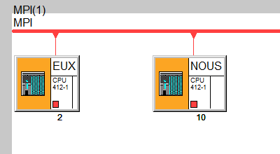
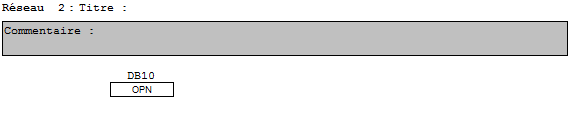
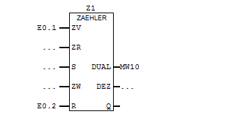
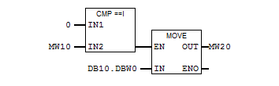
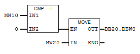
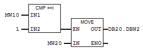

<a href=https://github.com/MJeremy/RLI>https://github.com/MJeremy/RLI</a>

THIRY Antoine - MAECK Jérémy

#**Rapport RLI**

Transferer les données d'un bloc de données globales vers un autre bloc de données globales sur une autre station connectée en MPI.

###1. Configuration du matériel

Premièrement il faut ajouter et configurer les deux machines sans oublier d'attribuer les bonnes adresses **MPI** à chaque machine.

###2. Configuration du réseau MPI

Cliquer sur le projet et sélectionner le réseau **MPI**. Dans la fenêtre qui s'ouvre, il faut relier les deux stations à la ligne rouge qui représente le réseau **MPI**.

###3. Ajout des blocs de données globales

Dans la fenêtre des blocs de chaque machine, créer un bloc de donnée et choisir *données globales* dans la fenêtre qui s'ouvre. 

1. Créer un **DB10** dans la première station et le remplir manuellement de 10 entiers.
2. Créer un **DB20** dans la seconde station et le remplir manuellement de 10 entiers nuls.

###4. Définition des données globales

Cliquer sur le projet et cliquer droit sur **"MPI"**, sélectionner **"Définir les données globales"** et rajouter deux lignes. On va utiliser deux *memento* afin de faire passer les valeurs du **DB10** sur la première station au **DB20** sur la seconde station. 

1. Double cliquer sur la deuxième colonne et ajouter le premier **CPU**.
2. Double cliquer sur la troisième colonne et ajouter le seconde **CPU**.

Dans cette fenêtre on peut définir quels éléments seront partagés entre les deux stations.

On va définir deux *mementos*, **MW10** et **MW20** en tant qu'émetteur sur la première station (Clic droit sur l'entrée du memento et définir en tant qu'émetteur). 

+ MW10 servira à transmettre l'état d'avancement du compteur pour savoir quelle valeur transférer.
+ MW20 servira à transmettre la valeur.

###5. Première station (OB1)

Tout d'abord il ne faut pas oublier d'ouvrir le **DB10** de la station en utilisant le bloc pour l'ouverture d'un DB (OPN).

Ensuite, définir un compteur en utilisant le bloc **ZAEHLER** et sortir le résultat dans **MW10**. 

Pour finir, créer un réseau par valeur à transférer et faire une comparaison du compteur (**MW10**) avec un entier et ensuite utiliser le bloc **MOVE** pour déplacer la valeur du **DB10** vers le *memento* **MW20**.

+ Pour sélectionner la première valeur dans le DB10 >> **DB10.DBW0**
+ Pour sélectionner la deuxième valeur dans le DB10 >> **DB10.DBW2**
+ ...

###6. Seconde station (OB1)

Comme pour la première station, ouvrir le **DB20**.

Ensuite comparer **MW20** avec un entier et déplacer la valeur du *memento* **MW20** vers le **DB20**.

###7. Fini

Charger et essayer.

