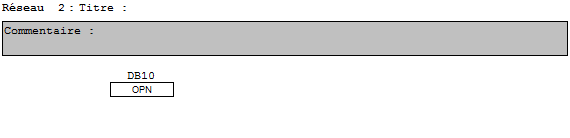

<a href=https://github.com/Mjeremy/RLI>https://github.com/Mjeremy/RLI</a>

THIRY Antoine - MAECK Jérémy

#**Rapport RLI n°2**

Transferer les données d'un bloc de données globales grâce au bloc de fonction **USEND** vers une autre station, connectée en MPI, qui les recevront via le bloc de fonction **URCV** 

###1. Configuration du matériel

Premièrement il faut ajouter et configurer les deux machines sans oublier d'attribuer les bonnes adresses **MPI** à chaque machine.

###2. Configuration du réseau MPI

Cliquer sur le projet et sélectionner le réseau **MPI**. Dans la fenêtre qui s'ouvre, il faut relier les deux stations à la ligne rouge qui représente le réseau **MPI**. Ensuite, configurer l'adresse locale de notre station de facon à pouvoir utiliser l'id dans les blocs de fonction.

###3. Ajout des blocs de données globales

Dans la fenêtre des blocs de chaque machine, créer un bloc de donnée et choisir *données globales* dans la fenêtre qui s'ouvre. 

1. Créer un **DB10** dans la première station et le remplir manuellement de 10 entiers.
2. Créer un **DB20** dans la seconde station et le remplir manuellement de 10 entiers nuls.

###4. Création de la fonction (FC1) dans la station 1 dédié à l'envoi des données

Tout d'abord il ne faut pas oublier d'ouvrir le **DB10** de la station en utilisant le bloc pour l'ouverture d'un DB (OPN).

Ensuite insérer le bloc de fonction système **USEND** (SFB8) et le configurer comme l'image suivante.

+	REQ : Paramètre de commande pour activer l'échange de données
+	ID : Identifiant de la station émettant les données
+	R_ID : Identifiant de la tâche d'envoie
+	SD_1 : Liste des données du bloc (DB10) à envoyer

###5. Création de la fonction (FC2) dans la station 2 dédiée à la réception des données

Tout d'abord il ne faut pas oublier d'ouvrir le **DB10** de la station en utilisant le bloc pour l'ouverture d'un DB (OPN).

Ensuite insérer le bloc de fonction système **URCV** (SFB9) et le configurer comme l'image suivante.

+ EN_R : Paramètre de commande pour la réception des données.
+ ID : Identifiant de la station recevant les données
+ R_ID : Identifiant de la tâche de réception. (Doit être différente de l'ID)
+ RD_1 : Endroit où les données recues seront placées.

###6.Création de l'OB1 dans la station 1

Il suffit simplement d'appeller la fonction **FC1** afin de lancer l'envoie des données.

###7.Création de l'OB1 dans la station 2

Appeller la fonction **FC2** afin de lancer la réception des données.

